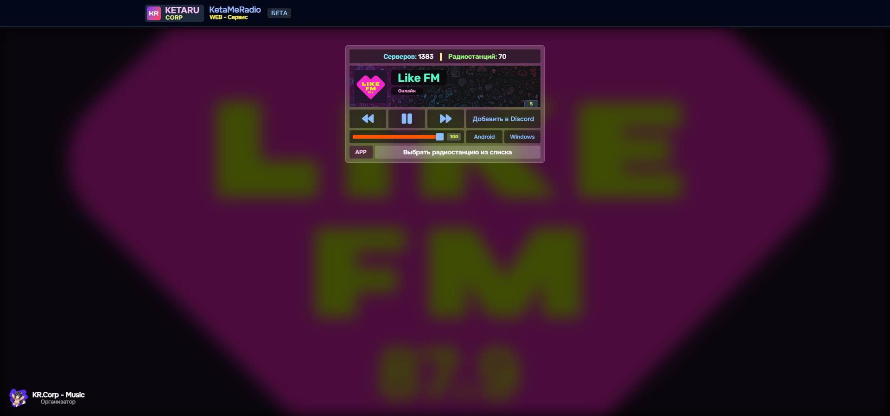
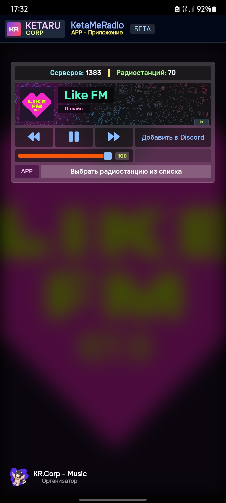
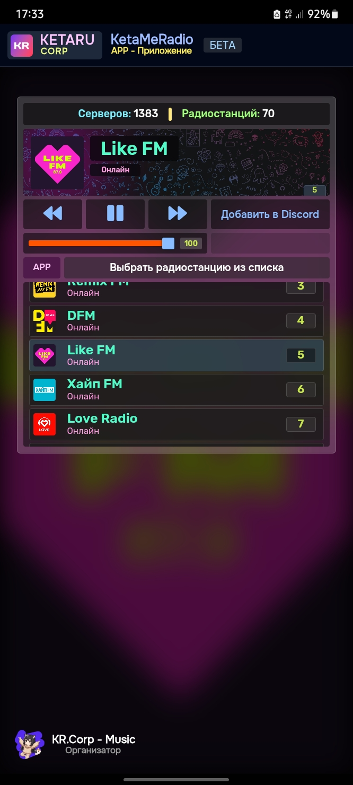

 

# 
Radio KetaRu

Powered by KetaruCorp ✨

Приложение для Android/Windows

## Android: [Radio.apk](https://github.com/lisikme/live.ketaru.com/releases/download/Stable/radio.apk)
## Windows: [Radio.exe](https://github.com/lisikme/live.ketaru.com/releases/download/Stable/radio.exe)

